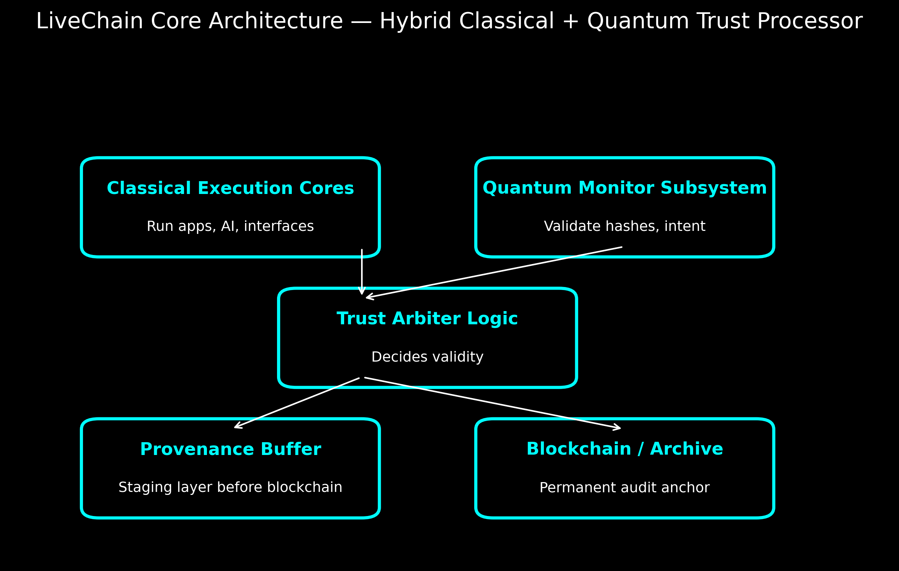

---

## 🧠 LiveChain Core: Hybrid Processor Architecture

To fully realize the LiveChain vision, we propose the **LiveChain Core** — a hybrid processor substrate that integrates classical execution with quantum-level validation.

This architecture flips the conventional stack:
- Classical systems handle **apps, UI, and inference**
- Quantum logic serves as the **oracle of provenance**, verifying hashes, behaviors, and lineage

### Core Components:
- **Classical Execution Cores**: Run system logic and AI with low latency
- **Quantum Monitor Subsystem**: Validates object and behavior hashes against quantum measurement data
- **Trust Arbiter Logic**: Routes verified data to blockchain or flags inconsistencies
- **Provenance Buffer**: Staging layer before immutable anchoring
- **Blockchain Archive**: Final ledger for tamper-proof audit trails

This inversion makes quantum computing the *substrate of trust*, not the application engine. It is the heart of real-time, verifiable memory.

[Download LiveChain Core Concept v0.1 PDF](LiveChain_Core_Concept_v0.1.pdf)
